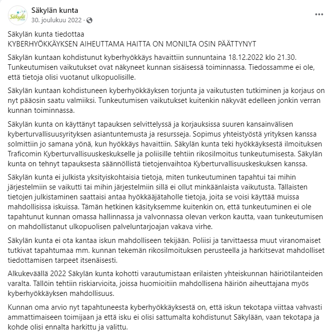

# Kyberhyökkäykset 
Tämän sivuston tarkoituksena on kerätä uutisia ensisijaisesti Suomeen kohdistuneista kyberhyökkäyksistä.  

## Suomeen kohdistuneiden kyberhyökkäysten aikajana

## 2019
### Espoon tietojenkalasteluhyökkäys
[Maaliskuussa 2019](https://yle.fi/a/3-11001705) yksitoista Espoon kaupungin työntekijää joutui tietojenkalastelun uhriksi. Kyseiset työntekijät olivat saaneet sähköpostin, joka vaikutti tulleen heidän työkavereiltaan. Sähköpostit sisälsivät linkin, joka johti nigerialaisten rikollisten ylläpitämälle sivulle ja se oli tehty muistuttamaan Microsoft Office -ohjelmien kirjautumisnäkymää. Työntekijät syöttivät käyttäjätunnuksensa ja salasanansa tälle sivulle, jolloin rikolliset saivat näiden henkilöiden kirjautumistunnukset haltuunsa. Kyseessä oli siis ns. credential harvester. Hyökkääjät avasivat saatujen tunnusten avulla  32 eri dokumenttiin, joiden joukossa oli pöytäkirjoja ja tiedotteita. Myös 9 eri henkilön arkaluonteiset tiedot vuotivat rikollisten päästessä käsiin sähköposteissa olleisiin kaupungin työntekijöiden ansioluetteloihin ja työsopimuksiin. Hyökkäyksen seurauksena Espoon kaupunki otti käyttöön kaksivaiheisen tunnistuksen tiedostojen avaamista varten. Lisäksi kaupunki aikoo lisätä henkilöstönsä tietoturvakoulutusta. 

### Lahden kaupungin kyberhyökkäys 
[Tiistaina 11. kesäkuuta 2019](https://yle.fi/a/3-10829719) Lahden kaupungin tietoverkkoihin kohdistettiin kyberhyökkäys, joka havaittiin virusturvaohjelmiston tunnistaessa [troijalaisen](https://yle.fi/a/3-10833458) yhdeltä koneelta. Yhdessä kunnan verkon koneista havaittiin haittaohjelma ja se ehti levitä suunnilleen tuhanteen työasemaan. Tämän seurauksena Lahden kaupungin ja Päijät-Hämeen hyvinvointiyhtymän väliset tietoliikenne yhteydet ajettiin alas väliaikaisesti. Hyökkäyksessä käytettiin hyväksi palomuureissa olevia ongelmia ja heikkoja salasanoja. Kyberhyökkäyksen hinta oli [8. elokuuta 2019 mennessä] tullut maksamaan lähes 700 000 euroa ja [loppuvuodesta 2019](https://yle.fi/a/3-11121273) hyökkäyksestä aiheutuneet kulut olivat nousseet noin 900 000 euroon. Hyökkäyksen vaikutuksesta Lahti alkoi panostamaan tietoverkkojen turvallisuuteen lisäämällä valvontaa ja jakamalla verkon pienempiin osiin. Hyökkäyksen suorittaneesta Suomen ulkopuolinen tahon  motiiveista ei ole tarkempaa tietoa. 

### Kokemäen hyökkäys 
[29. heinäkuuta 2019](https://yle.fi/a/3-10899935) kiristyshaittaohjelma pääsi Kokemäen kaupungin sisäiseen verkkoon ja palvelinympäristöön. Haittaohjelma ei kuitenkaan levinnyt kaupungin tietohallinnon ulkopuolelle. Lisäksi se ei vaikuttanut terveydenhuollon palveluihin, koska Kokemäen terveydenhuollon hoitaa Keski-Satakunnan terveydenhuollon kuntayhtymä. Kyseisestä kyberhyökkäyksestä tehtiin rikosilmoitus. 

### Porin tietomurto 
[Keskiviikkona 7. elokuuta 2019](https://yle.fi/a/3-10918474) Porin kaupungin opetusverkkoon kohdistettiin tietomurto, joka havaittiin kun yhdessä opetusverkon työasemasta havaittiin haittaohjelma. Kyseinen haittaohjelma oli tehty keräämään kirjautumistietoihin liittyvää dataa. Porin kaupungin IT-osaston mukaan tietomurto on tullut ulkomailta. Tämän tietomurron seurauksena kaikki opetusverkon käyttäjät joutuivat vaihtamaan salasanansa.  

Aluksi vaikutti siltä, että tietomurto ei olisi ollut erityisen vakava. Kuitenkin jo [perjantaina 9. elokuuta](https://yle.fi/a/3-10916012) paljastui tietomurron olleen luultua vakavampi. Tutkittaessa tietomurtoa tarkemmin paljastui tekijöiden päässeen käsiksi käyttäjien tiedostoihin.

### Siuntion tietomurto
[Torstaina 19. syyskuuta 2019](https://www.kirkkonummensanomat.fi/neo/?app=NeoDirect&com=6%2F159%2F49591%2F84e60230ec) Siuntion kuntaan kohdistettiin tietomurto. Tietomurroista saaduilla tiedoilla lähetettiin Siuntion kunnan nimissä kalasteluviestejä. Lähetettyjen sähköpostien otsikoissa viitattiin laskuihin ja viestit sisälsivät linkin huijareiden tekemälle sivulle, jonne käyttäjät ohjattiin syöttämään sähköpostitunnuksensa. 

## 2020
### Eduskunnan tietomurto
[Vuoden 2020 syksynä eduskuntaa kohdistettiin tietomurto.](https://yle.fi/a/3-11715912) Keskusrikospoliisin mukaan hyökkääjät olisivat päässeet vaarantamaan eduskunnan sähköpostitilien tietoturvan, mutta tietomurron laajudesta ei kerrottu sen enempää kuin että osa vaarantuneista tileistä kuului kansanedustajille. Suojelupoliisi kertoi 2021 kybervakoilun tulleen Kiinaan liittyvältä taholta ja että kyseessä olisi ryhmä nimeltä APT31, joka on tunnettu kiinalainen valtiollinen toimija. Kansanedustajille annettiin tapahtuneen seurauksena [tietoturvakoulutusta](https://yle.fi/a/3-11767479) ja lisäksi eduskunnan tietoturvaa vahvistettiin.

<!--
## 2021
### Eislakaisla kyberhyökkäys
[Perjantaina 8. Tammikuuta](https://yle.fi/a/3-11730761) henkilöstöyritys Eislakaislaan kohdistettiin kyberhyökkäys.
-->
## 2022
<!--
### Valtran kiristyshaittaohjelmahyökkäys
[Toukokuussa 2022](https://yle.fi/a/3-12439169) Valtran
-->

### Säkylän kyberhyökkäys
[Sunnuntaina 18. joulukuuta 2022 klo 21:30](https://alueviesti.fi/2023/02/02/kyberhyokkayksesta-arviolta-300-000-euron-lasku-sakylassa/) havaittiin Säkylän kuntaan kohdistettu kyberhyökkäys. Hyökkäys toteutettiin juuri ennen sote-uudistuksen määräpäivää samalla, kun Säkylän ja Satakunnan hyvinvointialueen välisten tietoverkkojen muutostyö oli kesken. Hyökkääjätahosta ei ole tietoa, mutta ottaen huomioon, että Säkylässä sijaitsee Huovirinteen varuskunta - herää varmasti epäilyksiä Venäjän mahdollisesta osallisuudesta hyökkäykseen. On myös hyvä ottaa huomioon  hyökkääjän ammattimaisuus ja sen, ettei Säkylän kunnassa ole mitään muuta merkittävää infrastruktuuria varuskunnan lisäksi. Kunnan oman arvion mukaan tekotapa sekä kohde olivat hyvin ennalta harkittuja. Hyökkäyksen hintalappu kohosi lähes 300 000 euroon.

 Säkylän kunta tiedotti Facebook-sivuillaan hyökkäysestä aiheutuneen haitan olleen merkittävästi päättynyt perjantaina 30. joulukuuta 2022. Tämän tapauksen myötä muidenkin paikkakuntien, joissa sijaitsee varuskuntia - tai muulla tavalla maanpuolustuksen kannalta merkittävää infrastruktuuria - tulisi varautua vastaavanlaisiin iskuihin.

Hyökkäyksen kohteena tai kohteina olevista järjestelmistä ei kerrottu. Voidaan siis vain arvailla, mikä oli hyökkääjien varsinainen tavoite. Joka tapauksessa kuntalaisten tietoja ei kuitenkaan tiettävästi vuotanut kolmansille osapuolille hyökkäyksen takia.

## 2023
### NoNamen syksyn 2023 kyberhyökkäys 
[Maanantaina 18. syyskuuta 2023](https://www.mtvuutiset.fi/artikkeli/venalainen-hakkeriryhma-vaittaa-hyokanneensa-suomeen-nama-sivut-kohteena/8781016) Venäjä-mielinen/venäläinen hakkeriryhmä NoName057(16) teki Suomeen useita palvelunestohyökkäyksiä. Kyseessä on sama ryhmä, joka on aikaisemmin kaatanut Suomen eduskunnan verkkosivut keväällä 2022 ja [suorittanut palvelunestohyökkäyksen 2023 syyskuun alussa Traficomin verkkosivuille](https://www.is.fi/digitoday/tietoturva/art-2000009838893.html). Tällä kertaa ryhmän mukaan kohteina oli VR, Traficom, ExpressBus ja Saimaan risteilyt. [Hyökkäyksen motiivina oli venäläisillä rekisteritunnuksia kantavien henkilöautojen maahantulon estäminen 16. syyskuuta 2023 alkaen.](https://www.mtvuutiset.fi/artikkeli/live-kello-13-30-ylen-mukaan-suomi-kieltaa-lahes-kaikkien-venalaisten-henkiloautojen-maahantulon-ulkoministeri-pitaa-infon/8778910#gs.5vpvw0) 

### Suomen puolustusteollisuuden tietomurto
[Torstaina 14. syyskuuta 2023](https://yle.fi/a/74-20050244) uutisoitiin Pohjois-Korean tekemistä murtautumisista Suomen puolustusteollisuuden tietojärjestelmiin. Viranomaistahot eivät ole kommentoineet mikä tai mitkä  yritykset olivat kyseessä. Microsoftin aiheeseen liittyvän [raportin](https://query.prod.cms.rt.microsoft.com/cms/api/am/binary/RW1aFyW) mukaan 5 prosenttia vakoiluaktiviteeteista on kohdistunut Suomeen. Esimerkiksi Etelä-Koreaan, Israeliin, Saksaan sekä Venäjään kohdistettiin kuhunkin 9 prosenttia vakoiluaktiviteeteista. 

### Osuuspankin palvelunestohyökkäys
[Keskiviikkona 4. lokakuuta 2023](https://yle.fi/a/74-20053580) Osuuspankin op.fi-palveluun kohdistettiin palvelunestohyökkäys. Venäläinen hakkeriryhmä Noname057(16) väittää [Telegram-kanavallaan](https://t.me/s/noname05716eng) olleensa hyökkäyksen takana. 

### Helsingin seudun liikenteen palvelunestohyökkäys
[Torstai-iltana 5. lokakuuta 2023](https://yle.fi/a/74-20053880) Helsingin seudun liikenteen (HSL) reittiopas oli alhaalla seuraavaan päivään klo 9:15 asti. Informaatiopäällikkö *Joona Packalén* kertoo HSL:ään kohdistuneiden palvelunestohyökkäysten määrän kasvaneen merkittävästi vuoden 2023 aikana. Packalénin mukaan tämän mittakaavan hyökkäyksiä ei ole aiemmin kohdistettu HSL:n palveluihin. Palvelunestohyökkäykseen liittyvä verkkoliikenne tuli EU-maiden ulkomailta. Hyökkäys on todennäköisesti Noname057(16) toimesta suoritettu, sillä se viestitti päivää aikaisemmin 

### Turun tietojenkalastelukampanja
[Perjantaina 13. lokakuuta](https://www.turku.fi/uutinen/2023-10-13_turun-kaupungin-tietoturvaa-loukattu-asiasta-tehty-rikosilmoitus) Turun kaupunki ilmoitti nettisivuillaan, että tietojenkalasteluviestejä on lähetetty @turku.fi ja @edu.turku.fi -osoitteista. Huijaussähköposteja lähetettiin sekä organisaation ulko- että sisäpuolelle. Joni Ilmanen eli Turun kaupungin IT-palvelujohtaja kertoo huijausviestien olleen erittäin taitavasti tehtyjä. Ilmasen mukaan viesteissä pyrittiin kalastelemaan ihmisten käyttäjätunnuksia sekä salasanoja eli sähköpostit ovat olleet tyypiltään ns. 'credential harvestereita'.

### Viking Linen Palvelunestohyökkäys
[Torstai-iltapäivällä 19. lokakuuta 2023](https://yle.fi/a/74-20056204) Viking Linen verkkosivuille kohdistettiin palvelunestohyökkäys. Hyökkäyksen seurauksena nettisivut olivat alhaalla seuraavaan päivään asti kunnes ne saatiin jälleen toimimaan. Viking Linen tiedotusjohtaja Johanna Boijer-Svahströmin mukaan hyökkäys oli osa laajempaa palvelunestohyökkäyskampanjaa, sillä hyökkäyksiä oli kohdistettu myös muihin Euroopassa sijaitseviin varustamoihin.  

### Suomen tietomurtoaalto
[Perjantaina 20. lokakuuta 2023](https://www.is.fi/digitoday/tietoturva/art-2000009936173.html) laajasta suomalaisiin kohdistuvasta tietojenkalastelukampanjasta. Hyökkäyksessä ihmisille lähetetään sähköposteja, jotka muistuttavat turvasähköposteja. Sähköposteissa oleva linkki johtaa kuitenkin rikollisten ylläpitämälle sivulle, jossa käyttäjät huijataan syöttämään Microsoft-tiliensä tunnuksilla. 

### Rautavaaran kunnan kyberhyökkäys
[Maanantai aamuyönä 23. lokakuuta 2023](https://kuntalehti.fi/uutiset/tekniikka/rautavaaralla-korjataan-kyberhyokkayksen-jalkia-hallinnon-tiedostoja-kryptattu/) havaittiin Rautavaaraan verkkopalveluihin kohdistunut kyberhyökkäys. Hyökkääjätaho oli salannut hallintoverkossa olleita tiedostoja ja vaatinut rahaa salauksen purkamista vastaan. Hyökkäys onnistuttiin rajaamaan kunnanhallinnon palvelimelle eikä sillä tiettävästi ollut vaikutusta kunnan muihin järjestelmiin.

## Muut merkittävät kyberhyökkäykset
#### Wannacry-kiristyshaittaohjelma 2017
[Perjantaina 12. toukokuuta 2017](https://www.ts.fi/uutiset/3511587) useisiin maihin kohdistettiin kyberhyökkäys, joka oli laajudeltaan merkittävä, sillä se vaikutti 150 maan tietojärjestelmiin. Hyökkäyksissä hyödynnettiin vanhempien Windows käyttöjärjestelmien haavoittuvuuksia. Hyökkäys vaikutti laajasti eri toimialueihin hyökkäyksestä kärsivät muun muassa Britannian julkinen terveydenhoitojärjestelmä, Saksan rautatieyhtiö Deutsche Bahn sekä espanjalainen teleoperaattori Telefonica. Lisäksi ranskalaisen autonvalmistaja Renaultin tuotanto keskeytettiin eri puolilla Eurooppaa.

Kyseessä olevissa hyökkäyksissä hyödynnettiin [WannaCry](https://www.ts.fi/uutiset/3511170) haittaohjelmaa, joka on tyypiltään kiristyshaittaohjelma. Ohjelma salaa käyttäjän tiedostot ja vaatii vastineeksi tiedostojen salauksen poistamiseksi lunnaita Bitcoineina. Hyökkäys vaikutti erityisesti Windows 7 -käyttöjärjestelmän käyttäjiin, sillä [98 % haittaohjelman uhreista](https://www.bleepingcomputer.com/news/security/over-98-percent-of-all-wannacry-victims-were-using-windows-7/) käytti Windows 7 -käyttöjärjestelmää. Hyökkäyksen takia Microsoft [julkaisi tietoturvapäivityksiä](https://www.theguardian.com/technology/2017/jun/14/wannacry-attacks-prompt-microsoft-to-release-updates-for-older-windows-versions) vanhemmille käyttöjärjestelmiin kuten Windows XP:lle ja Windows 2003:lle.

